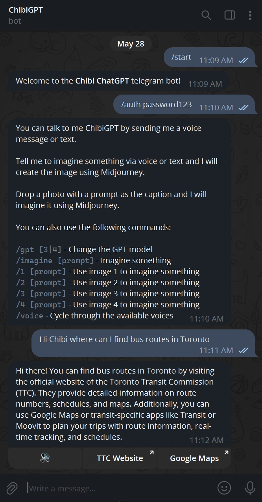
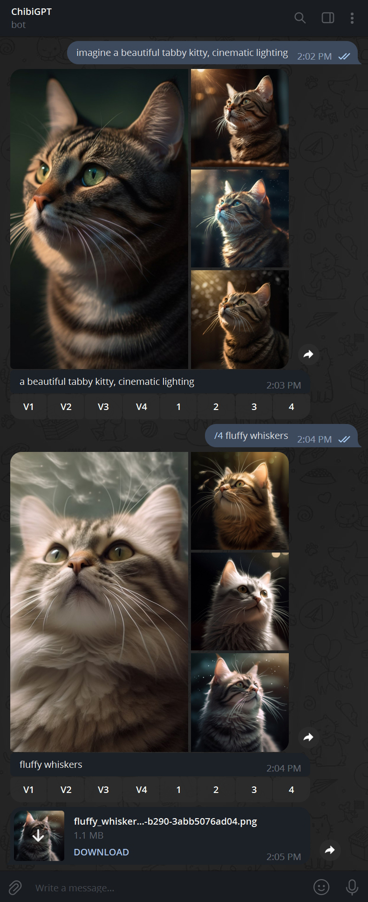
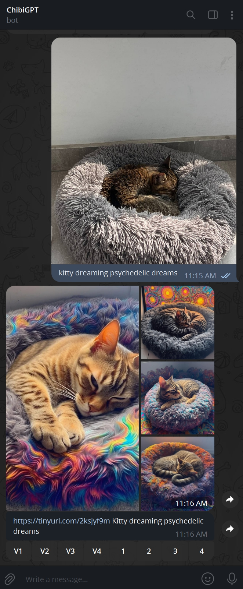

# Chibi ChatGPT Telegram Bot

This is a Telegram bot that uses:

- OpenAI's ChatGPT
- [LangchainJS](https://github.com/hwchase17/langchainjs) to constructs prompts, handle convo history and interact with Google
- [MidJourney](https://www.midjourney.com) to imagine images
- OpenAI's Whisper API to generate text from voice
- [Play.ht](https://play.ht) to generate voice from text and reply to voice messages
- Google Translate API for multi-language voice responses

## Features

#### ChatGPT

- Talk to ChatGPT via text or voice
- Generate voice files for long responses via button
- Provides links to sources / additional inforation along with responses via buttons
- Language detection/translation for voice
- Commands to change the model and temperature on the fly

#### Midjourney

- Talk to Midjourney via text or voice by starting with the word imagine (or use the /imagine command)
- Midjourney quad-image results delivered as individual images
- Buttons for creating variations and downloading upscaled images under photo responses (like the discord)
- Drop a photo, write in a prompt as the caption, and it will imagine based off the photo
- Reimagine commands for using a generated image as an input to another prompt

## Commands

```
/gpt <3|4> - Changes the GPT model
/focused - Produces more focused, conservative, and consistent responses
/balanced - Strikes a balance between creativity and consistency
/inventive - Produces more creative and diverse outputs wtih some level of consistency
/creative - Generates the most creative, diverse, and unexpected outputs
/imagine <prompt> - Imagines an image, you can use Midjourney parameters here
/1 <prompt> - Reimagines 1 with another prompt
/2 <prompt> - Reimagines 2 with another prompt
/3 <prompt> - Reimagines 3 with another prompt
/4 <prompt> - Reimagines 4 with another prompt
/voice - Cycles through the available voices
```

## Screenshots







## Installation

> Prerequisite: You need Node 18, you'll also need `ffmpeg` installed to use voice interactions.

1. `git clone https://github.com/marcelo-mason/chibigpt`
2. `cd chibigpt`
3. `cp .env.example .env` and fill the following:

   ```
   AUTH_PASSWORD= #password to access the bot
   TELEGRAM_TOKEN=
   OPENAI_API_KEY=
   MIDJOURNEY_SALAI_TOKEN=
   MIDJOURNEY_SERVER_ID=
   MIDJOURNEY_CHANNEL_ID=
   PLAY_HT_USER_ID=
   PLAY_HT_SECRET_KEY=
   GOOGLE_PROJECTID=
   GOOGLE_API_KEY=
   DEFAULT_COUNTRYCODES=en-US #hardcodes the country code for the language (if english only use US voices)
   STORE_LOCATION=./store #where voice files and sessions are stored
   ```

   ## Telegram Setup

   - [Create bot on Botfather and get token](https://sendpulse.com/knowledge-base/chatbot/telegram/create-telegram-chatbot)

   ### Open AI Setup

   - [Create Account](https://platform.openai.com/signup?launch)
   - [Create API Key](https://platform.openai.com/account/api-keys)
   - [Request ChatGPT4 API Access](https://openai.com/waitlist/gpt-4-api)

   ### Midjourney Setup

   - [Create Account](https://www.midjourney.com/home)
   - [Set your own Discord server](https://www.ionos.com/digitalguide/server/know-how/how-to-set-up-a-discord-server/)
   - [Invite the Midjourney bot to your server](https://docs.midjourney.com/docs/invite-the-bot)
   - [Get your Salai Token](https://linuxhint.com/get-discord-token/)
   - [Get your Server ID](https://www.alphr.com/discord-find-server-id/)
   - [Get your Channel ID](https://turbofuture.com/internet/Discord-Channel-ID)

   ### PlayHT Setup

   - [Create Account](https://play.ht/signup)
   - [Create API Key](https://play.ht/app/api-access)

   ### Google Translation Setup

   - [Create a Project](https://console.cloud.google.com/projectcreate)
   - [Enable Cloud Translation API](https://console.cloud.google.com/apis/dashboard)
   - [Create API Key](https://console.cloud.google.com/apis/credentials)

4. `npm install`
5. `npm start`
